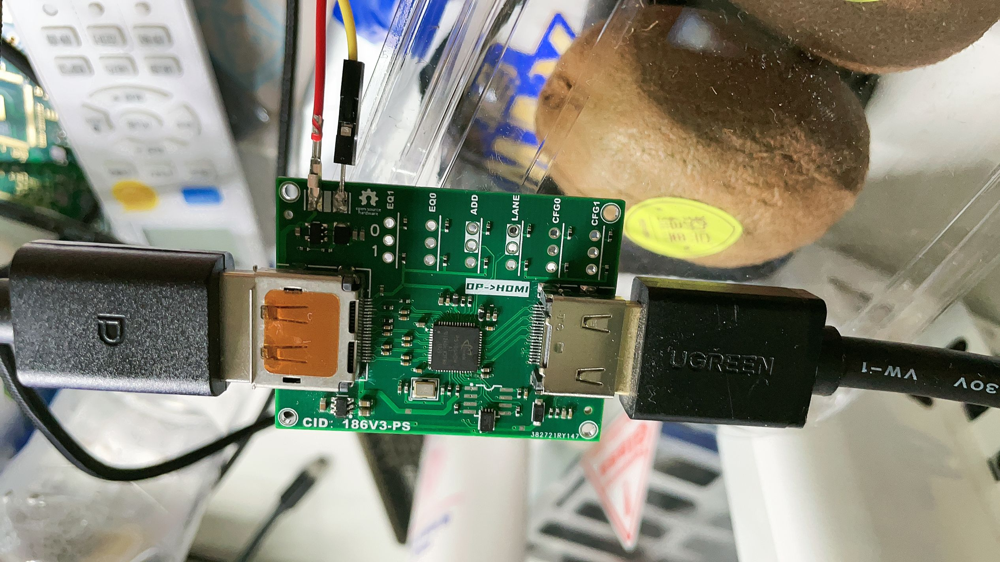

# TARS01：*DisplayPort(DP)*

> 该项目指在将信号转译成其他信号。

## 项目位点
### 0x01 DP1.2 转 HDMI
输出信号，点亮屏幕。

- 项目芯片：**PS176**

- 性能测试：显示器`1080P@144hz`，通过测试，测试时长：两小时半

<!--  -->

### 图集

### 0x02 DP1.4 转 HDMI
输出信号，点亮屏幕。

- 项目芯片：**PS186**

- 性能测试：显示器`2K@144hz`，通过测试，测试时长：两小时半

<!--  -->

### 图集

